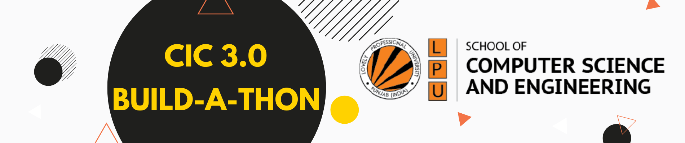

# CIC 3.0 Build-a-thon

Welcome to the CIC 3.0 Build-a-thon organized by the School of Computer Science and Engineering (CSE), Lovely Professional University!

## Problem Statement

<!-- [Brief description of the problem participants will be solving during the hackathon. It should be clear, concise, and provide enough context for participants to understand the challenge.] -->
**Theme Based Problems**    
**1.⁠ ⁠FITNESS AND SPORTS**   
Description :-Ideas that can boost fitness activities and assist in keeping fit.   
**2.	 AGRICULTURE, FOODTECH & RURAL DEVELOPMENT**   
Description: - Developing solutions, keeping in mind the need to enhance the primary sector of India - Agriculture and to manage and process our agriculture produce.    
**3.	 SMART VEHICLES**   
Description: - Creating intelligent devices to improve commutation sector.    
**4.	 CLEAN & GREEN TECHNOLOGY**   
Description: - Solutions could be in the form of waste segregation, disposal, and improve sanitization system.    
**5.	 RENEWABLE/ SUSTAINABLE ENERGY**   
Description: - Innovative ideas that help manage and generate renewable /sustainable sources more efficiently    
**6.	 DISASTER MANAGEMENT**   
Description: - Disaster management includes ideas related to risk mitigation, Planning and management before, after or during a disaster.    

## How to Participate

1. **Create a Repository**: Participants should create a new repository on GitHub for their hackathon project.

2. **Work on Your Solution**: Work on your solution to the problem statement within your repository.

3. **Submission**: Submit your solution by creating a Pull Request (PR) to the main repository of the hackathon. Make sure to follow the submission guidelines provided in the hackathon repository.

## Rules

- Participants must adhere to the following rules:
  - Code submissions must be original and not plagiarized.
  - Teams must consist of <!-- [specify team size]. -->
  - All submissions must be made within the specified time frame.
  - Any violations of the rules may result in disqualification.

## Team Size

- Teams should consist of 3 members. Solo participants are also welcome.

## Contact Information

For any queries or clarifications, reach out to Rajan Kakkar.

  

Best of Luck
